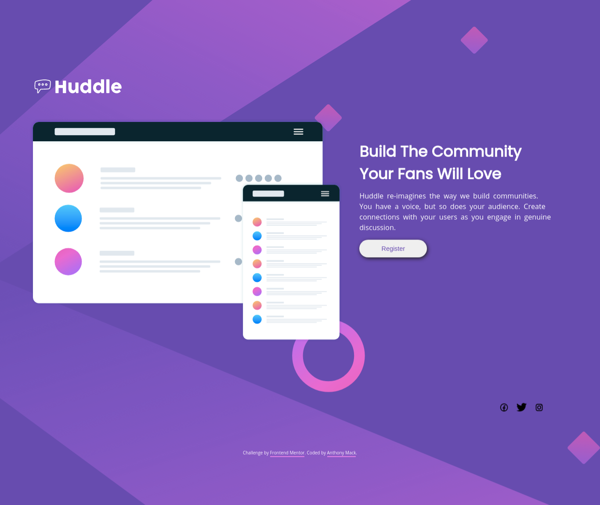

# Frontend Mentor - Huddle landing page with single introductory section solution

This is a solution to the [Huddle landing page with single introductory section challenge on Frontend Mentor](https://www.frontendmentor.io/challenges/huddle-landing-page-with-a-single-introductory-section-B_2Wvxgi0). Frontend Mentor challenges help you improve your coding skills by building realistic projects. 

## Table of contents

- [Overview](#overview)
  - [The challenge](#the-challenge)
  - [Screenshot](#screenshot)
  - [Links](#links)
- [My process](#my-process)
  - [Built with](#built-with)
  - [What I learned](#what-i-learned)
  - [Continued development](#continued-development)
  - [Useful resources](#useful-resources)
- [Author](#author)
- [Acknowledgments](#acknowledgments)

## Overview

### The challenge

Users should be able to:

- View the optimal layout depending on their device's screen size
- See hover states for interactive elements

### Screenshot

images/Frontend Mentor - Huddle landing page screenshot.png

### Links

- Solution URL: [GitHub/TXMack713](https://github.com/TXMack713/huddle-landing-page)
- Live Site URL: [GitHub Pages] (https://txmack713.github.io/huddle-landing-page/)

## My process

I started with the mobile layout first and then after I was satisfied with the mobile layout, I proceeded to create the desktop layout. After observing how disproportionate the size of the `.landing` and `#layouts` sections were, I created a second desktop layout for smaller screens that incorporated a smaller heading size for better proportions between the `#layouts` image and the `.landing` paragraph.

I checked other learners' code on frontendmentor.io to see how they were solving the issue of sizing and positioning the desktop background image to better match the desktop's design preview. I began by working on adjusting only the size of the background using the various keywords and then began working on moving the `#layouts` and `.landing` sections up and down within the grid, but after researching background positioning articles on css-tricks and W3Schools, I changed the background's psotionining from `center` `center` to `bottom` `center` and the size from `cover` to `auto`.

Finally, I changed the mobile layout's `icon` positioning from flexbox to grid for greater control over the spacing.

### Built with

- Semantic HTML5 markup
- CSS custom properties
- CSS Grid
- Mobile-first workflow

### What I learned

I learned how to use the background shorthand to set the background's color, add an image, position the image, set 
it to not repeat and to cause the image to be fixed in place.

By experimenting with placing the grid items using the line numbers and using grid areas, I learned that grid areas 
gave me better control over the positioning when using justify-content.

By testing the layout on my personal machine as well as my workstation, I noticed how differently the page will 
render even when using the same browser at the same zoom level.

Using margins on the anchor elements in the icon section allowed me to space out the social media icons to the 
degree I wanted.

I initially tried using the recommended sources for the social media icons, but noticed that whether I downloaded 
them as `svg` files or `png` files, the icons would not render on the page. I eventually decided on linking directly 
to the source page for free each icon I wanted to use as this method was successful in getting the icons to render 
on the page.

```css
body {
  display: grid;
  min-block-size: 100%;
  background: hsl(257, 40%, 49%) url("./images/bg-desktop.svg") no-repeat fixed top center;
  background-size: cover;
  grid: repeat(10, minmax(8.33%, 1fr)) / repeat(10, minmax(auto, 144px));
  grid-template-areas:
      "...... ...... ...... ...... ...... ...... ...... ...... ...... ......"
      "header header ...... ...... ...... ...... ...... ...... ...... ......"
      "layouts layouts layouts layouts layouts layouts landing landing landing landing"
      "layouts layouts layouts layouts layouts layouts landing landing landing landing"
      "layouts layouts layouts layouts layouts layouts landing landing landing landing"
      "layouts layouts layouts layouts layouts layouts landing landing landing landing"
      "layouts layouts layouts layouts layouts layouts landing landing landing landing"
      "...... ...... ...... ...... ...... ...... ...... ...... ...... ......"
      "...... ...... ...... ...... ...... ...... ...... ...... icons icons"
      "footer footer footer footer footer footer footer footer footer footer";
  justify-content: center;
  padding: 5%;
  margin: 0 auto;
}

#layouts {
  /*     grid-area: 3 / 1 / 9 / 7; */
  grid-area: layouts;
  inline-size: 100%;
  justify-self: center;
  align-self: center;
}

.landing {
  /*         grid-area: 3 / 7 / 7 / 11; */
  grid-area: landing;
  text-align: left;
  margin: 7.5% 7.5% 0 7.5%;
  justify-content: start;
  justify-self: center;
  align-self: start;
}

.icons {
  /*     grid-area: 9 / 9 / 10 / 11; */
  grid-area: icons;
  display: flex;
  justify-content: flex-end;
  align-items: center;
  padding-right: 20%;
}

.icons > a {
  padding: 0 3.75%;
}
```

### Continued development

- I'm continuing to learn CSS layout, particularly CSS Grid as I find that I have greater control over and confidence in the placement of items in my layouts.

### Useful resources
- The MDN Web Docs (https://developer.mozilla.org/en-US/) and W3Schools (http://w3schools.com) has proved to be 
  invaluable for 
  quick 
  lookups 
  regarding the 
  different values for certain properties and seeing them in action before implementing them.

## Author

- Website - [Anthony Mack](https://github.com/TXMack713/)
- Frontend Mentor - [@TXMack713](https://www.frontendmentor.io/profile/txmack713)

### Acknowledgements
